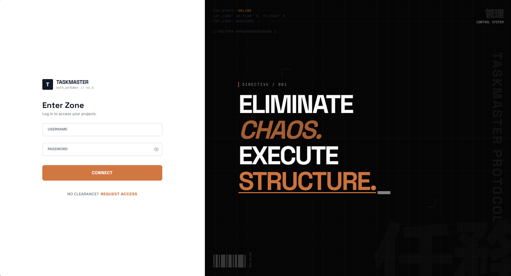
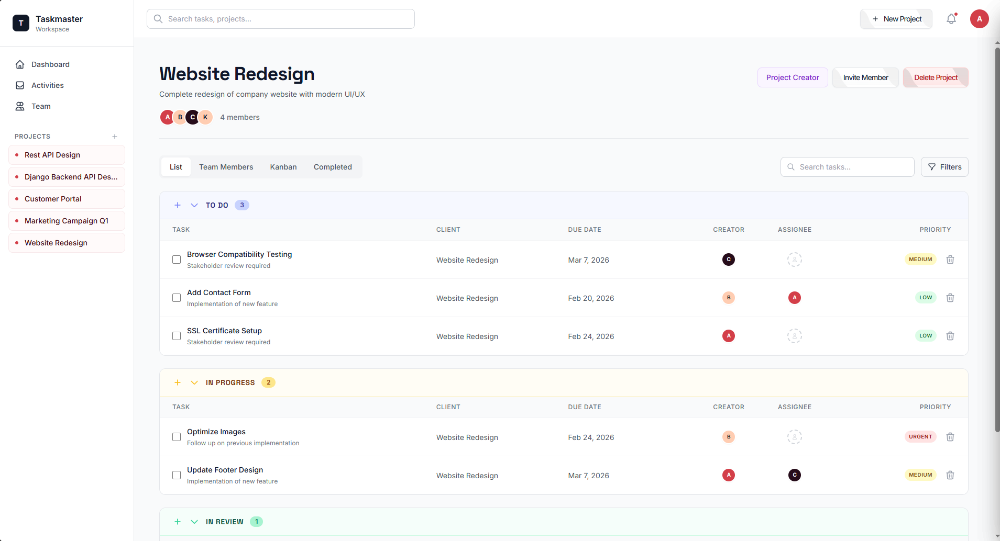
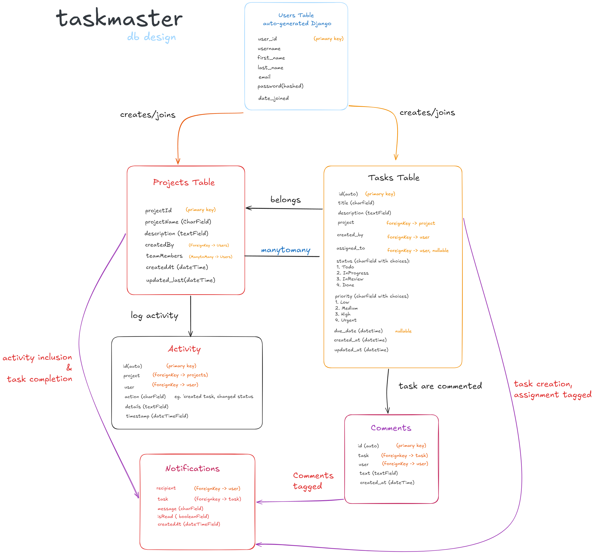
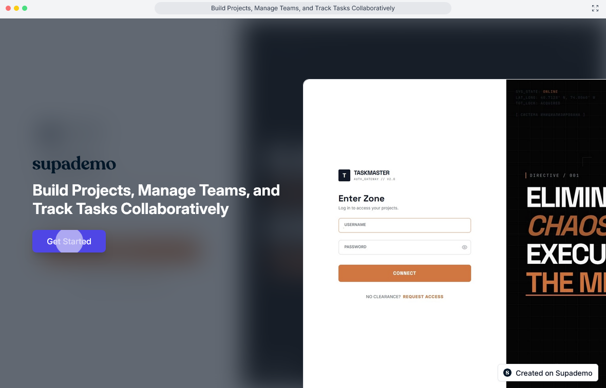
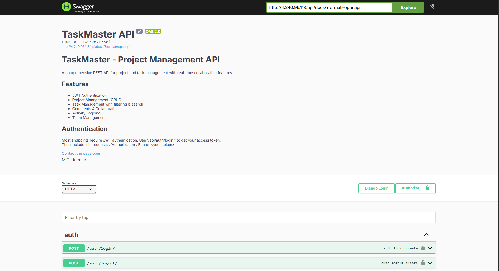

<div align="center">
  <h1>🚀 TaskMaster</h1>
  <p><strong>A Production-Grade, Real-Time Project Management Platform</strong></p>

  
  <p>
    
    
    
    
    
    
    
    
  </p>
</div>
  

<br>

> **Live Demo:** [Demo Link](http://4.240.96.118/login.html)
> **API Documentation:** [Swagger Documentation](http://4.240.96.118/api/docs/)
> **Interactive Video Walkthrough:** [Supademo](https://app.supademo.com/demo/cmmnqrj1l3kp29cvj9mfnxwj5?utm_source=link)

TaskMaster is a comprehensive, fully containerized project management application. Designed to move beyond standard CRUD operations, this project implements complex relational databases, strict role-based access controls, and asynchronous WebSockets for real-time collaboration.

> **Taskmaster Login**


> **Taskmaster Dashboard**


> **DB Design**


> **Taskmaster Supademo**



---

## ✨ Core Features

* **Real-Time Collaboration:** Tasks updated by one user instantly update across all connected clients via WebSockets.
* **Complete Workspace Management:** Full CRUD capabilities for Projects, Tasks, and Team Members.
* **Interactive Kanban Board:** Drag-and-drop task management built entirely with Vanilla JavaScript.
* **Granular Access Control:** Strict UI and API-level permissions distinguishing between Project Creators and Team Members.
* **Advanced Querying:** Backend filtering, sorting, pagination, and text search for large datasets.
* **Live Activity Feed:** Django Signals automatically map and broadcast system-wide activity and user notifications.
* **Auto-Generated API Docs:** Fully interactive Swagger UI and ReDoc documentation for over 35 API endpoints.

---

## 🏗️ System Architecture & Tech Stack

TaskMaster is orchestrated via Docker Compose into four distinct, specialized containers, sitting securely behind an Nginx reverse proxy.


### ⚙️ Backend (Django REST Framework)
* **API:** Python / Django REST Framework
* **Async Engine:** Django Channels + Daphne (ASGI)
* **Authentication:** JSON Web Tokens (JWT)
* **Message Broker:** Redis (for WebSocket group broadcasting)
* **Database:** PostgreSQL

### 🖥️ Frontend (Vanilla JavaScript)
* **Logic:** Vanilla JS (ES6+)
* **Styling:** CSS / TailwindCSS (via CDN for UI components)
* **Architecture:** Modular, component-based fetching and DOM manipulation.

### ☁️ DevOps & Deployment
* **Proxy & Web Server:** Nginx (Handling CORS, serving static files, and proxying HTTP/WS traffic)
* **Containerization:** Docker & Docker Compose
* **Cloud Hosting:** Microsoft Azure Virtual Machine

---

## 📡 The API

The backend exposes over 35 meticulously documented REST endpoints. The API handles everything from secure token refreshes to complex relational queries. 



*To explore the API locally, navigate to `/api/docs/` after spinning up the containers. or head to the link on the top.*

---

## 🚀 Local Setup & Installation

Because the entire environment is Dockerized, getting TaskMaster running on your local machine takes minutes, regardless of your operating system.

### Prerequisites
* Docker and Docker Compose installed on your machine.
* Git.

### 1. Clone the repository
```bash
git clone [https://github.com/yourusername/taskmaster-main.git](https://github.com/yourusername/taskmaster-main.git)
cd taskmaster-main
```

### 2. Configure Environment Variables

Create a `.env` file in the root directory and add the following parameters:

Code snippet

```
# Django Settings
SECRET_KEY=your_super_secret_key
DEBUG=True
ALLOWED_HOSTS=*

# Database Settings
POSTGRES_DB=taskmaster_db
POSTGRES_USER=postgres
POSTGRES_PASSWORD=your_password
POSTGRES_HOST=db
POSTGRES_PORT=5432

# Redis
REDIS_URL=redis://redis:6379/0
```

### 3. Build and Run the Containers

Bash

```
docker compose up -d --build
```

### 4. Run Migrations & Collect Static Files

Bash

```
docker compose exec backend python manage.py migrate
docker compose exec backend python manage.py collectstatic --noinput
```

### 5. Access the Application

- **Frontend UI:** `http://localhost`
    
- **API Documentation:** `http://localhost/api/docs/`
    
- **Django Admin:** `http://localhost/admin/`
    

---

## 📚 Engineering Documentation

Building this application involved solving dozens of complex architectural challenges. I documented the entire journey, including debugging WebSocket handshakes, configuring Nginx routing, and optimizing PostgreSQL queries.

Check out the `docs/` folder for 100+ markdown files detailing the engineering decisions, issues faced, and solutions implemented throughout the development lifecycle.

---

_Built by **[Keshav Maiya]** - Feel free to connect on [LinkedIn](https://www.linkedin.com/in/keshavrajmaiya/)!_